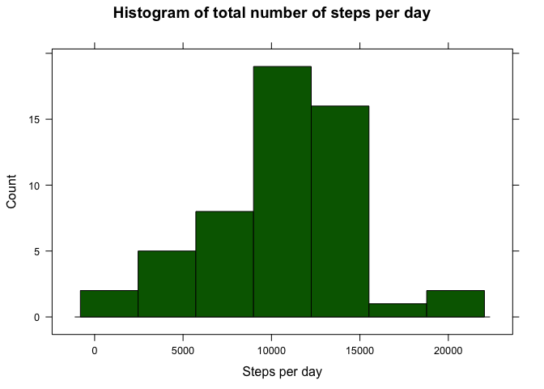
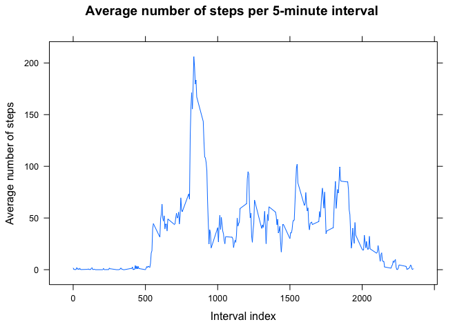
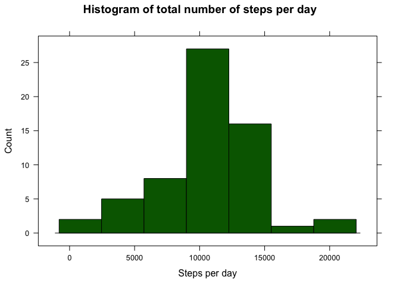
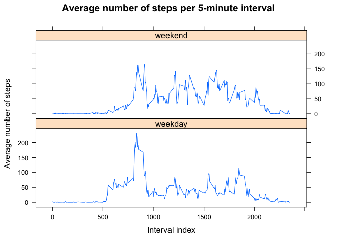

# Reproducible Research: Peer Assessment 1


```r
library(lattice)
library(plyr)
```

## Loading and preprocessing the data

The data for this report is stored in the CSV file `activity.csv` which is archived inside `activity.zip`. To read the data, we need to unzip the file and use `read.csv` to parse it. We'll also convert the `date` column to contain actual `Date` objects.

```r
activity <- read.csv(unz('activity.zip', 'activity.csv'))
activity$date <- as.Date(activity$date)
str(activity)
```

```
## 'data.frame':	17568 obs. of  3 variables:
##  $ steps   : int  NA NA NA NA NA NA NA NA NA NA ...
##  $ date    : Date, format: "2012-10-01" "2012-10-01" ...
##  $ interval: int  0 5 10 15 20 25 30 35 40 45 ...
```

## What is mean total number of steps taken per day?

To answer this question, we first need to calculate the total number of steps taken each day:

```r
stepsPerDay <- aggregate(steps ~ date, activity, sum, na.rm = TRUE)
stepsPerDay <- rename(stepsPerDay, c('steps' = 'totalSteps'))
head(stepsPerDay)
```

```
##         date totalSteps
## 1 2012-10-02        126
## 2 2012-10-03      11352
## 3 2012-10-04      12116
## 4 2012-10-05      13294
## 5 2012-10-06      15420
## 6 2012-10-07      11015
```
Next, let's draw a histogram to get an idea of the shape of the data. We'll use `lattice` for our plots:

```r
histogram(~ totalSteps,
          data = stepsPerDay,
          main = 'Histogram of total number of steps per day',
          type = 'count',
          xlab = 'Steps per day',
          col = 'darkgreen')
```

<!-- -->

We can clearly see from the histogram that most days the total amount of steps taken varies betewwn 10000 and 15000. Let's also take a look at the mean and median values:


```r
mean(stepsPerDay$totalSteps)
```

```
## [1] 10766.19
```

```r
median(stepsPerDay$totalSteps)
```

```
## [1] 10765
```

## What is the average daily activity pattern?

Again, lets first aggregate the data. We need the number of steps for each interval, averaged over all days.


```r
avgStepsPerInterval <- aggregate(steps ~ interval, activity, mean, na.rm = TRUE)
avgStepsPerInterval <- rename(avgStepsPerInterval, c('steps' = 'avgSteps'))
head(avgStepsPerInterval)
```

```
##   interval  avgSteps
## 1        0 1.7169811
## 2        5 0.3396226
## 3       10 0.1320755
## 4       15 0.1509434
## 5       20 0.0754717
## 6       25 2.0943396
```

And here is a time series plot of the aggregated data:


```r
xyplot(avgSteps ~ interval,
       data = avgStepsPerInterval,
       type = 'l',
       main = 'Average number of steps per 5-minute interval',
       xlab = 'Interval index',
       ylab = 'Average number of steps')
```

<!-- -->

It can be seen from the plot that there is a peak of activity in the morning and the rest of the activity is spread uniformly throughout the day. Let's find out which is the most intensive 5-minute interval:


```r
avgStepsPerInterval[which.max(avgStepsPerInterval$avgSteps),]
```

```
##     interval avgSteps
## 104      835 206.1698
```

Having the highest amount of steps on average at around 8:35 AM is reasonable since most people rush to go to work or school at that time.

## Imputing missing values

Let's take a look at the amount of missing values in the dataset:


```r
sum(is.na(activity$steps))
```

```
## [1] 2304
```

We'll fill in the missing values by taking the rounded mean value for the corresponding 5-minute interval across all days. We'll impute the missing values in a copy of the original dataset, called `act`.


```r
act <- data.frame(activity)
act$steps <- sapply(seq_along(act$steps), function(i) {
    if (is.na(act$steps[i]))
        round(avgStepsPerInterval[avgStepsPerInterval$interval == act$interval[i], 'avgSteps'])
    else
        act$steps[i]
})
```

Let's now redraw the histogram for total number of steps per day and see how imputing the missing values has affected the data:


```r
stepsPerDay <- aggregate(steps ~ date, act, sum, na.rm = TRUE)
stepsPerDay <- rename(stepsPerDay, c('steps' = 'totalSteps'))
histogram(~ totalSteps,
          data = stepsPerDay,
          main = 'Histogram of total number of steps per day',
          type = 'count',
          xlab = 'Steps per day',
          col = 'darkgreen')
```

<!-- -->

```r
mean(stepsPerDay$totalSteps)
```

```
## [1] 10765.64
```

```r
median(stepsPerDay$totalSteps)
```

```
## [1] 10762
```

We see that there is only a small difference in the mean and median values and the overall shape of the histogram has also been preserved.

## Are there differences in activity patterns between weekdays and weekends?

Let's add a new column to the `act` dataset, indicating whether the corresponding `date` is a weekday or a weekend:

```r
isWeekend <- weekdays(act$date, TRUE) %in% c('Sat', 'Sun')
act$day <- as.factor(ifelse(isWeekend, 'weekend', 'weekday'))
head(act)
```

```
##   steps       date interval     day
## 1     2 2012-10-01        0 weekday
## 2     0 2012-10-01        5 weekday
## 3     0 2012-10-01       10 weekday
## 4     0 2012-10-01       15 weekday
## 5     0 2012-10-01       20 weekday
## 6     2 2012-10-01       25 weekday
```

Now let's compare the average activity per 5-minute interval for weekdays and weekends respectively:


```r
avgSteps <- aggregate(steps ~ interval + day, act, mean)
xyplot(steps ~ interval | day,
       data = avgSteps,
       type = 'l',
       layout = c(1, 2),
       main = 'Average number of steps per 5-minute interval',
       xlab = 'Interval index',
       ylab = 'Average number of steps')
```

<!-- -->

From this comparison we can clearly see that during weekends, the person's activity is more uniformly distrubuted across the day, while during weekdays, there is a spike of activity in the morning and reduced activity for the rest of the day.
